# CR380 — Docker Lab

> **FR** : Suite de tests automatisés et tutoriels interactifs pour apprendre [Docker](https://www.docker.com/) dans le cadre du cours CR380 — *Introduction aux conteneurs* à Polytechnique Montréal.
>
> **EN**: Automated test suite and interactive tutorials for learning [Docker](https://www.docker.com/) as part of the CR380 — *Introduction to Containers* course at Polytechnique Montréal.

Docker est un outil de conteneurisation d'applications.
Ce dépôt contient **12 labs progressifs** (00–11) plus un nettoyage final (99) qui couvrent la désinstallation, l'installation, la configuration, Docker Hub, la construction d'images, l'optimisation, les multi-stage builds, ENTRYPOINT/CMD, COPY/ADD, les volumes et la persistance.

Docker is an application containerization tool.
This repository contains **12 progressive labs** (00–11) plus a final teardown (99) covering uninstallation, installation, configuration, Docker Hub, image building, optimization, multi-stage builds, ENTRYPOINT/CMD, COPY/ADD, volumes and persistence.

---

## Démarrage rapide / Quick Start

```bash
# Mode interactif étudiant — explications bilingues, pauses entre les étapes
# Interactive student mode — bilingual explanations, pauses between steps
sudo ./run-labs.sh --learn

# Mode validation enseignant — rapide, silencieux, résumé à la fin
# Teacher validation mode — fast, quiet, summary at end
sudo ./run-labs.sh --validate

# Exécuter un seul lab / Run a single lab
sudo ./run-labs.sh --learn --lab 07
```

> **Prérequis / Prerequisites** : Ubuntu 24.04 LTS (amd64), accès `sudo`, connexion Internet, 10 Go+ d'espace disque libre.
> Voir le [cloud-init](cloud-init/) pour la configuration de la VM / See [cloud-init](cloud-init/) for VM setup.

---

## Progression des labs / Lab Progression

Les labs sont organisés en **5 phases d'apprentissage**. Chaque lab dépend du précédent dans sa phase.

The labs are organized into **5 learning phases**. Each lab depends on the previous one within its phase.

```mermaid
graph LR
    subgraph "🔧 Phase 1 — Installation et configuration / Setup"
        L00["00 · Preflight"]
        L01["01 · Désinstallation<br/>Uninstall"]
        L02["02 · Installation<br/>Install"]
        L03["03 · Post-installation<br/>Post-install"]
        L04["04 · Premiers conteneurs<br/>First Containers"]

        L00 --> L01 --> L02 --> L03 --> L04
    end

    subgraph "📦 Phase 2 — Images et conteneurs / Images & Containers"
        L05["05 · Docker Hub"]
        L06["06 · Structure d'image<br/>Image Structure"]
        L07["07 · Réduire le poids<br/>Slim Images"]

        L04 --> L05 --> L06 --> L07
    end

    subgraph "🏗️ Phase 3 — Construction avancée / Advanced Builds"
        L08["08 · Multi-stage builds"]
        L09["09 · ENTRYPOINT &amp; CMD"]
        L10["10 · COPY, ADD &amp; docker cp"]

        L07 --> L08 --> L09 --> L10
    end

    subgraph "💾 Phase 4 — Persistance / Persistence"
        L11["11 · Volumes"]

        L10 --> L11
    end

    L99["99 · Nettoyage final<br/>Final Teardown"]
    L11 -.->|cleanup| L99

    style L00 fill:#e8f5e9
    style L11 fill:#e3f2fd
    style L99 fill:#ffebee
```



---

## Résumé des labs / Lab Summary

| # | Lab | Description FR | Description EN | Commande clé / Key Command |
|---|-----|---------------|----------------|---------------------------|
| 00 | **Preflight** | Vérifier l'environnement (OS, sudo, réseau, disque) | Verify environment (OS, sudo, network, disk) | — |
| 01 | **Désinstallation** | Supprimer Docker complètement pour repartir à zéro | Remove Docker completely for a clean start | `sudo apt-get purge docker-ce docker-ce-cli containerd.io` |
| 02 | **Installation** | Installer Docker CE via le dépôt APT officiel | Install Docker CE via the official APT repository | `sudo apt-get install docker-ce docker-ce-cli containerd.io` |
| 03 | **Post-installation** | Ajouter l'utilisateur au groupe docker, tester hello-world | Add user to docker group, test hello-world | `sudo usermod -aG docker $USER` |
| 04 | **Premiers conteneurs** | Lancer Debian interactif et Nginx avec mapping de ports | Launch interactive Debian and Nginx with port mapping | `docker run -dit --name debianCT debian` |
| 05 | **Docker Hub** | Chercher, télécharger et inspecter des images | Search, pull and inspect images | `docker search nginx && docker pull nginx:alpine` |
| 06 | **Structure d'image** | Construire une image, inspecter les couches, docker exec | Build an image, inspect layers, docker exec | `docker build -t monimage:structure -f dockerfiles/dockerfile-structure .` |
| 07 | **Réduire le poids** | Construire une image optimisée, comparer les tailles | Build an optimized image, compare sizes | `docker build -t monimage:structure-slim -f dockerfiles/dockerfile-slim .` |
| 08 | **Multi-stage** | Construire Drupal 10 avec un build multi-étape | Build Drupal 10 with a multi-stage build | `docker build -t monimage:multi-stage -f dockerfiles/dockerfile-multistage .` |
| 09 | **ENTRYPOINT & CMD** | Comprendre ENTRYPOINT exec form, CMD, --entrypoint | Understand ENTRYPOINT exec form, CMD, --entrypoint | `docker run img:entrypoint` |
| 10 | **COPY, ADD & docker cp** | Transférer des fichiers hôte↔conteneur, COPY vs ADD | Transfer files host↔container, COPY vs ADD | `docker cp fichier.txt copyCT:/tmp/` |
| 11 | **Volumes** | Créer et monter un volume persistant, bind mount | Create and mount a persistent volume, bind mount | `docker volume create www_data` |
| 99 | **Nettoyage** | Tout supprimer et repartir à zéro | Delete everything and start fresh | `sudo ./run-labs.sh --validate --lab 99` |

---

## Comprendre les résultats / Understanding Results

```
✓  Test réussi / Test passed
✗  Test échoué / Test failed — lisez le HINT / read the HINT
⊘  Test ignoré / Test skipped — dépendance non satisfaite / unmet dependency
```

Quand un test échoue, le script affiche :
- **Attendu / Expected** — le résultat attendu
- **Obtenu / Actual** — le résultat obtenu
- **💡 HINT** — une suggestion pour résoudre le problème

When a test fails, the script shows:
- **Expected** — what was expected
- **Actual** — what was obtained
- **💡 HINT** — a suggestion to fix the issue

---

## Modes d'exécution / Execution Modes

| Drapeau / Flag | Mode | Description |
|----------------|------|-------------|
| `--validate` | Enseignant / Teacher | Exécution rapide, résumé à la fin / Fast run, summary at end |
| `--learn` | Étudiant / Student | Explications bilingues, pause entre chaque étape / Bilingual explanations, pause between steps |
| `--lab NN` | Lab unique / Single lab | Exécuter uniquement le lab NN / Run only lab NN |
| `--reset NN` | Réinitialisation / Reset | Nettoyer puis réexécuter le lab NN / Clean then rerun lab NN |
| `--quick` | Rapide / Quick | Sauter install si Docker est déjà présent / Skip install if Docker present |
| `--diff` | Comparaison / Compare | Comparer les 2 derniers rapports JSON / Compare last 2 JSON reports |
| `--verbose` | Verbeux / Verbose | Afficher toutes les sorties / Show all output |

---

## Structure du projet / Project Structure

```
CR380-docker-lab/
├── run-labs.sh               # Lanceur principal / Master runner
├── run-teacher-validation.sh # Validation enseignant / Teacher validation
├── config.env                # Configuration centrale / Central config
├── tests/
│   ├── _common.sh            # Framework de test / Test framework
│   ├── 00-preflight.sh       # → 11-volumes.sh  (12 labs)
│   └── 99-teardown.sh        # Nettoyage final / Final cleanup
├── dockerfiles/
│   ├── dockerfile-structure   # Lab 06 — Image structure
│   ├── dockerfile-slim        # Lab 07 — Slim image
│   ├── dockerfile-multistage  # Lab 08 — Multi-stage build
│   ├── dockerfile-entrypoint  # Lab 09 — ENTRYPOINT & CMD
│   └── entrypoint.sh          # Lab 09 — Script de démarrage
├── gitbook/                   # Pages GitBook bilingues / Bilingual GitBook pages
├── cloud-init/
│   ├── user-data-fresh.yaml         # VM propre / Clean VM
│   ├── provision-multipass.sh       # Lanceur Multipass (Linux/macOS) / Multipass launcher (Linux/macOS)
│   └── provision-multipass.bat      # Lanceur Multipass (Windows) / Multipass launcher (Windows)
├── results/                   # Rapports JSON / JSON reports (auto-generated)
└── logs/                      # Journaux détaillés / Detailed logs (auto-generated)
```

---

## Référence du cours / Course Reference

📖 [CR380 — Introduction aux conteneurs (GitBook)](https://polytechnique-montreal.gitbook.io/cr380/)

---

## Licence / License

Ce projet est utilisé à des fins pédagogiques dans le cadre du cours CR380 à Polytechnique Montréal.

This project is used for educational purposes as part of the CR380 course at Polytechnique Montréal.
